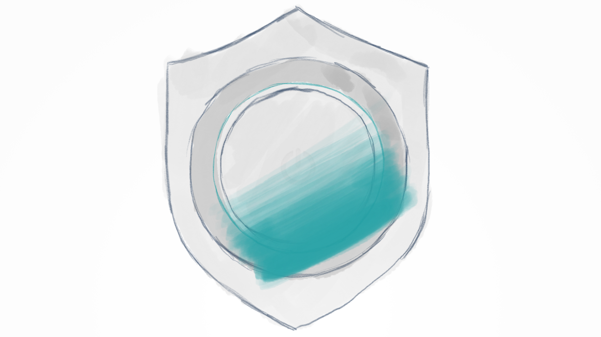
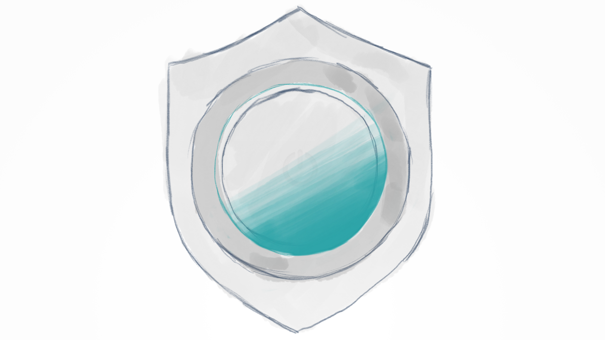
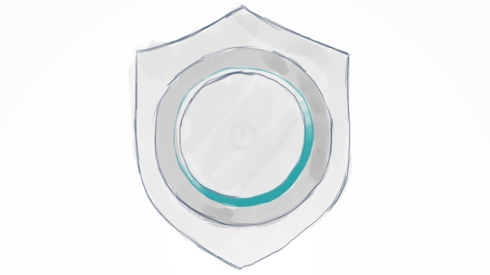

footer: @iwantmyrealname

#[fit] Views & Animations:
#[fit] __Learning__ by
#[fit] _Stealing_


[github.com/sammyd/MobileUnplugged2018_UI](https://github.com/sammyd/MobileUnplugged2018_UI)

---

# [fit] _why_
# [fit] __steal?__

---

#[fit] _where_ to
#[fit] __start?__

---


---


---


---


---

#[fit] Views -vs- layers
#[fit] `CAShapeLayer`
#[fit] `UIBezierPath`
#[fit] Layer shadows

---

#[fit] #code

---


---

#[fit] `CAShapeLayer`
#[fit] `CAGradientLayer`
#[fit] Layer masks

---


PaintCode

---


KiteApp

---

#[fit] #code

---


---



---



---



---

#[fit] `CAGradientLayer`
#[fit] Layer Masks
#[fit] `CAAnimation`

---

#[fit] #code

---


---


---


---

#[fit] `CAAnimation`
#[fit] Layer masks
#[fit] `CAShapeLayer`

---

#[fit] __so__
#[fit] what?

---

#[fit] learning

---

#[fit] practice

---

#[fit] mistakes

---


---

#[fit] Custom modal
#[fit] Presentation controller
#[fit] Transitioning delegate
#[fit] Property animator

---

#[fit] _interactive_
#[fit] map?

---

```swift
override func hitTest(_ point: CGPoint,
                   with event: UIEvent?) -> UIView? {
  let hit = super.hitTest(point, with: event)
  if hit != self {
    return hit
  }
  for passthroughView in passthroughViews {
    let hit = passthroughView.hitTest(
      convert(point, to: passthroughView),
      with: event)
    if hit != .none {
      return hit
    }
  }
  return .none
}
```

---

#[fit] __incorrect__
#[fit] model

---

#[fit] _maybe_
#[fit] __contained__
#[fit] view controllers

---

#[fit] _doesn't_
#[fit] __matter__

---

#[fit] __learning__

---

#[fit] __practice__

---

#[fit] __mistakes__

---


---

#[fit] @iwantmyrealname

#[fit]~

#[fit] [github.com/sammyd](https://github.com/sammyd/MobileUnplugged2018_UI)
#[fit] [/MobileUnplugged2018_UI](https://github.com/sammyd/MobileUnplugged2018_UI)
